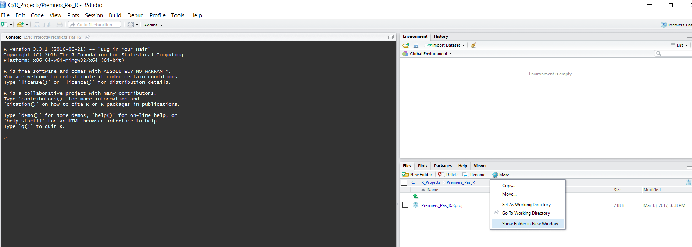
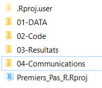
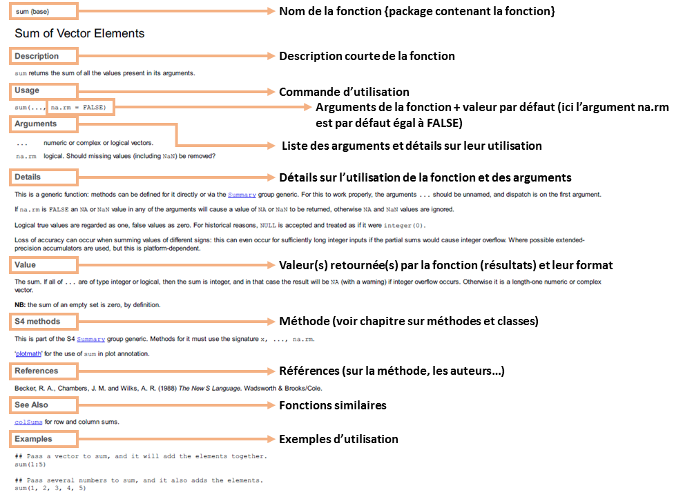

# Premiers pas {#Premiers}  
  
## Ouvrir un projet RStudio  

Pour commencer vous allez apprendre à créer votre premier projet RStudio. Travailler en projet est l'essence même du travail sous RStudio car cela apporte de nombreux avantages. En effet, un projet RStudio est un dossier contenant un projet quelconque, qui se doit être le plus indépendant possible. En effet, celui-ci contiendra toutes les étapes dont vous aurez besoin pour réaliser votre projet: les données, les scripts **R** ou autre, les logiciels tiers, les résultats intermédiaires et finaux, ainsi que les communications. Il est important de bien prendre connaissance de cette partie car elle conditionne de nombreuses étapes qui suivent. Croyez-moi, travailler en projet est une merveille dès qu'on a bien compris comment ça marche.  

Avant tout, je vous conseille de créer un dossier général nommé "R_Projects" sur votre ordinateur dans un emplacement de votre choix (qui pourra contenir beaucoup de données).  
Ensuite, pour commencer un projet, ouvrez RStudio, et cliquez sur File/New Project/New Directory/Empty project:

Ici, RStudio vous demande un nom de projet et un emplacement dans lequel ranger votre projet. Le nom de projet doit toujours être court mais le plus explicite possible, tout en évitant les caractères spéciaux (&/%-) ou les espaces (remplacez-les par "_"). Ensuite, cliquer sur browse puis choisissez l'emplacement de votre dossier R_Projects si vous l'avez déjà crée (fortement recommandé). Pour notre exemple, on nommera notre projet "Premiers_Pas_R", et on le rangera dans le dossier "C:/R_Projects" comme suit:  
```{r Create project, echo=FALSE}
knitr::include_graphics(c("Images/01-New_Project.png","Images/02-New_Directory.png","Images/03-Empty_Project.png",
                          "Images/04-New_Project.png"))
```

Tada ! Vous venez de créer un projet RStudio. Maintenant il ne manque plus qu'à travailler.  
  
## Organiser son projet {#organise_project}
  
Un des avantages des projets est le fait que RStudio défini automatiquement le répertoire de travail à la racine du projet. Le répertoire de travail est le chemin du dossier dans lequel est situé votre projet. Dans mon exemple, celui-ci est "C:/R_Projects/Premiers_Pas_R". Dans **R**, on peut modifier le répertoire de travail manuellement en utilisant la commande `setwd`. Par exemple, si je ne veux travailler que dans mon dossier code, je pourrais utiliser la commande:  
```{r wd, eval=FALSE}
setwd("02-Code/")
```
Le répertoire de travail sert à spécifier des chemins d'accès relatifs. En effet, pour lire un fichier qui se situe dans le répertoire `01-DATA`, il existe deux façons de le faire.  
Soit en spécifiant le chemin complet, depuis la racine du disque :  
```{r wd2, eval=FALSE}
fichier= read.table("C:/R_Projects/01-DATA/fichier.txt")
```
  
Soit en utilisant un chemin relatif par rapport au projet :  
```{r wd3, eval=FALSE}
fichier= read.table("01-DATA/fichier.txt")
```
  
Cela peut paraître trivial à première vue, mais cette astuce devient très pratique lorsque les chemins deviennent longs (pensez aux chemins de la vie réelle, comme "C:/Users/username/Desktop/Docs_R/Simulations/22-01-1990/test/test2"), ou lorsque l'on partage des scripts entre collègues (pas besoin de modifier les chemins lorsqu'on passe son projet).
Pour voir quel est votre répertoire de travail, vous pouvez soit le trouver écrit en haut de la console, soit simplement tapper la commande suivante:
```{r getwd, eval=FALSE}
getwd()
```
  
  
Maintenant que le répertoire de travail n'a plus de secret pour vous, nous allons l'organiser. Pour mieux comprendre comment un projet s'organise, il faut d'abord l'ouvrir dans le gestionnaire de fichiers. Pour ouvrir la fenêtre contenant le projet, vous pouvez cliquer sur More/Show Floder in New Window comme suit :  
```{r Show Folder, echo=FALSE}

```
  
Vous allez donc voir apparaître le dossier du projet dans une nouvelle fenêtre. Il n'y a rien de très intéressant à l'intérieur du projet pour l'instant: le fichier Premiers_Pas_R.Rproj et un dossier caché ".Rproj.user" (sa visibilité n'est absolument pas requise). Les fichiers .Rproj servent à ouvrir RStudio avec les paramètres du projet. Lorsque vous voulez ré-ouvrir votre projet après l'avoir quitté, il vous faudra double-cliquer sur ce fichier.
Maintenant nous allons commencer à pré-organiser ce dossier. Personnellement j'aime créer une suite de dossiers numérotés dans lesquels je range des fichiers triés selon l'avancée du projet comme ceci:  

```{r Rproj, echo=FALSE}

```
  
Le premier dossier 01-DATA contient toutes les données de départ dont à besoin le projet. Il peut s'agir d'images, de fichiers textes ou de tableurs, il seront tous présents dans ce dossier.  
Le second dossier 02-Code contient tous les scripts pour **R** ou pour tout autre logiciel, numérotés eux aussi dans l'ordre d'éxécution. En général je regroupe aussi les fonctions utilisées dans les scripts dans un seul et même script **R** appelé 0-Fonctions, que j'appelle ensuite depuis les autres scripts. Si vous ne comprenez rien à la phrase précédente, ne vous en faites pas nous aborderons les fonctions très vite (référence chapitre fonctions).  
Le troisième dossier 03-Resultats est le dossier qui contient tous les résultats, intermédiaires ou finaux. il peut s'agir de figures, de données, de modèles ou tout autre résultat du projet.  
Enfin, le dernier dossier 04-Communications est un dossier contenant les communications sur le projet. En effet, RStudio permet l'édition de documents pdf, word et html afin de faciliter la communication. Ce livre est d'ailleurs écrit avec Rstudio. Nous parlerons des communications dans le chapitre (mettre référence chapitre communications).  
Je vous incite à créer ces 4 dossiers vides à chaque fois que vous créez un nouveau projet Rstudio. Vous pouvez le faire soit manuellement, soit en utilisant la commande ci-dessous:  
```{r organise, eval=FALSE}
lapply(X = list("01-DATA","02-Code","03-Resultats","04-Communications"), FUN = dir.create)
```

Attention, avant d'exécuter la commande précédente veuillez vous assurer d'avoir ouvert le projet dans RStudio, et donc que votre répertoire de travail soit bien à la source du projet !

  
## Créer un script **R**
  
**R** est un language intérprété, c'est à dire qu'il interprête (exécute) vos commandes en temps réel. Vous pouvez dès à présent intéragir avec **R** dans l'onglet *console* de RStudio, qui se trouve en bas à gauche. Vous pouvez par exemple taper la commande suivante:  
```{r commande simple, eval=FALSE}
1+3
```
  
**R** vous retournera alors le résultat du calcul juste après votre commande :  
```{r commande simple resultat, echo=FALSE}
1+3
```

On vient donc de voir que **R** peut être utilisé comme une calculatrice, mais celui à bien plus à offrir. En effet, vous pouvez par exemple créer des objets que **R** sauvera dans la mémoire vive^[**R** fonctionne exclusivement avec la mémoire vive (ajouter renvoi vers chapitre optimiser **R**)] durant toute votre session^[voir définition [wikipédia](https://fr.wikipedia.org/wiki/Session_(informatique))].  
Voici un premier exemple assez simple et concret: 
vous êtes partis en mission avec votre collègue qui a payé la totalité des frais. Pour le rembourser vous avez noté toutes les dépenses: 53.26€ de trajet, 108.30€ de repas, et 145.50€ pour la nuitée. Vous devez donc sommer toutes les dépenses et diviser par deux le total pour connaître votre part, comme ceci: 
```{r}
(53.26+108.30+145.50)/2
```
Maintenant, si vous partez régulièrement ensemble, il peut être pratique de garder une trace de chaque élément, avec quelques explications pour chacune. Pour celà, il vous suffit de créer un script **R**. Un script est en fait simplement un fichier texte qui présente l'extension `.R` au lieu de `.txt`. Ce fichier sert de support pour l'écriture de commandes **R**.  
Pour créer votre premier script **R**, cliquez sur fichier (file) -> nouveau fichier (New File) -> R script, ou alors en utilisant le raccourci clavier (`ctrl+shit+N`).  
RStudio va alors ouvrir un script vierge sans titre et non sauvegardé. La première chose à faire est d'écrire un titre. Bien sûr vous ne voulez pas que **R** exécute le titre ou les commantaires. Pour celà, vous devez lui indiquer que la ligne que vous insérez ne doit pas être interprétée en commençant la ligne par un `#`. Voici un exemple, la première ligne est un commentaire, **R** ne l'interprète pas, alors que la seconde oui:   
```{r}
# 2+3
5+6
```
Comme vous pouvez le voir **R** retourne 11, qui est le résultat de la deuxième ligne.  
Vous pouvez donc écrire votre titre de la même façon, sans que **R** ne s'en préoccupe:  
```{r}
# Script R pour remboursement des frais:

# Lundi 24/04/2017: 53.26€ de trajet, 108.30€ de repas, et 145.50€ pour la nuitée
(53.26+108.30+145.50)/2 # Vous pouvez aussi taper un comentaire après une ligne de commande
```
Pour éxécuter une ligne de commande (i.e. envoyer une ligne à **R**) depuis votre script, il vous suffit d'utiliser le raccourcis clavier `ctrl+r`, ou d'utiliser le bouton "run" dans la barre en haut de votre script. 

Vous pouvez maintenant enregistrer votre script en cliquant sur Fichier (File) -> Enregistrer sous (save as), ou par le raccourci clavier `Ctrl+s`. Ensuite vous devrez nommer votre script, et je vous encourage fortement à l'enregistrer dans le dossier `02-Code` si vous avez suivi le précédent point: [Organiser son projet]. 


## Créer des objets et les manipuler
  
### Objet unique  
Maintenant que vous savez utiliser les calculs sous **R** et les commenter, vous allez voir comment simplifier vos scripts et vos calculs grâce à la création d'objets.  
Pour reprendre l'exemple précédent, nous allons créer plusieurs objet qui déterminent chacun une dépense : 
```{r}
Trajet= 53.26
repas= 108.30
hotel= 145.50
```
Cette écriture est très intuitive car elle ressemble à celle que l'on écrirait sur un bout de papier. Ce qui est intéressant avec **R**, c'est que celui-ci enregistre la valeur associée à chaque objet, ainsi, si on éxécute le nom de l'objet, **R** nous retournera sa valeur :
```{r}
Trajet
```
On peut maintenant utiliser des opération mathématiques directement sur nos objets, comme l'addition:
```{r}
Trajet+repas+hotel
```
Vous remarquerez que `Trajet` comporte une majuscule. **R** est un language sensible à la casse, c'est à dire qu'il fait la différence entre une majuscule et une minuscule, si bien que `Trajet` est différent de `trajet`. Regardez par vous même:  
```{r}
trajet= 8
Trajet
trajet
```
Ensuite, on peut assigner ce nouveau résultat à un nouvel objet, appelé pour l'occasion `Depenses_07_Avril`, qui contient les dépenses du 07 du mois d'avril:  
```{r}
Depenses_07_Avril= Trajet+repas+hotel
```
Notez bien la structure du code : l'objet `Depenses_07_Avril` est suivi d'un `=`, puis chaque nombre est additionné un à un. Ainsi, **R** fait d'abord le calcul de l'addition des objets à droite, puis assigne le résultat à l'objet nouvellement créé. On peut maintenant demander à **R** la valeur des dépenses :
```{r}
Depenses_07_Avril
```
  

### Vecteur

La manière précédente est intéressante, mais ne permet malheureusement pas de garder une trace du calcul dans l'objet. En effet, `Depenses_07_Avril` ne contient que la somme des dépenses de la journée, mais pas leur détail. Pour se faire, nous pouvons créer un vecteur contenant chaque dépense de la journée :
```{r}
Depenses_07_Avril= c(Trajet,repas,hotel)
Depenses_07_Avril
```

Notez bien la structure du code ci-dessus. Chaque dépense est séparée par une virgule, et le tout est mis entre parenthèses précédées d'un `c`. Il est important de bien comprendre ce qu'il se passe ici. Pour faire court, nous avons créé un vecteur comportant trois nombres : 53.26, 108.30 et 145.50 rangés des objets appelés Trajet,repas et hotel repsectivement, puis nous les avons assignés à un nouvel objet `Depenses_07_Avril`. Maintenant, `Depenses_07_Avril` ne contient plus la somme de chaque dépense, mais chacune de leur valeur. En réalité, nous avons utilisé ici deux fonctions: la fonction d'assignation `=`, et la fonction de coercion `c`. Nous avons déjà vu la première, qui sert à assigner une ou des valeurs à un objet. La seconde quand à elle permet de concaténer plusieurs éléments en un seul objet qui  sera un vecteur. Une vecteur est donc une suite de valeurs indépendantes.
L'avantage d'un vecteur est de garder chaque valeur, et de pouvoir opérer des opérations mathématiques sur l'objet entier. Par exemple, si on veut obtenir la somme des dépenses de la journée, on pourra utiliser la fonction associée `sum`:
```{r}
Depenses_07_Avril= c(Trajet,repas,hotel)
sum(Depenses_07_Avril)
```
Cette fonction additione tous les éléments du vecteur.  
Les opérations mathématiques usuelles ont toutes leurs propres fonctions:
```{r}
sum(Depenses_07_Avril)  # somme des éléments
mean(Depenses_07_Avril) # moyenne des éléments
Depenses_07_Avril*2     # multiplication de chaque élément par 2
Depenses_07_Avril/2     # division de chaque élément par 2
Depenses_07_Avril%%2    # modulo 2 de la divison (retourne le reste de la division par deux)
```

D'autres objets plus complexes existent dans **R**, comme les matrices, les tableaux, ou les listes. Ils seront détaillés dans le prochain chapitre.  

## Introduction aux fonctions, aux packages et à l'aide  
**R** est un language fonctionel, c'est à dire qu'il utilise un paradigme de programmation basé sur les fonctions. **R** est d'ailleurs particulièrement orienté fonctions car pratiquement tout est considéré comme tel (nous verrons cela dans le chapitre dédié aux fonctions).
Le très grand intérêt de **R** est donc de disposer de nombreuses fonctions qui servent d'utilitaires. On dit qu'avec **R** la question n'est jamais "Est-il possible de ...?" mais toujours "Comment fait-on ...?". La raison est qu'il y a presque toujours une personne qui a déjà fait ce que vous voulez faire, et que la solution est très souvent disponible sous la forme d'une fonction disponible dans un package, sur un dépôt de type Gitlab/Github ou dans des commentaires sur Stackoverflow.com.  
Une fonction comporte un nom, et est suivie d'arguments entre parenthèse. Nous avons déjà utilisé plusieurs fonctions précédemment: la fonction `c`, la fonction `sum` et la fonction `mean`.
Pour connaître les arguments d'une fonction, il vous suffit d'exécuter son nom précédé d'un point d'intérogation, ou bien de surligner son nom et d'appuyer sur la touche `F1` de votre clavier dans RStudio. Apparaîtra alors la documentation de la fonction, qui est toujours structuré de la même manière: 
En haut se trouve le nom de la fonction suivi du nom de son package entre crochets (nb: base est le package intégré de base dans R).
Ensuite vient une description brève, puis son utilisation. Ici apparaitra donc les différentes façons d'utiliser la fonction, ainsi que les valeurs par défaut de ses paramètres. 
Vient ensuite une description de chaque arguments (synonyme de paramètres), puis de certains détails d'utilisation, des valeurs retournées par la fonction (Value), puis enfin les notes, les références, les fonctions liées (see also) et, le plus important, d'exemples.
Alons voir l'aide de la fonction `sum`:
```{r, eval=FALSE}
?sum
```

Voici le résultat anotté:  
```{r Aide sum, echo=FALSE}

```

Comme on peut le voir, la fonction `sum` vient du package `base`, qui est en fait un package qui est chargé dès l'ouverture de R.
De nombreuses fonctions sont disponibles dans d'autres packages. Les packages sont regroupés dans un dossier appelé "libraire". Pour connaître l'emplacement de votre librairie sur votre ordinateur, vous pouvez exécuter la fonction `.libPaths()` :
```{r}
.libPaths()
```

Certains packages sont téléchargés en même temps que votre installation de **R** et placés dans votre librairie. Pour utiliser les fonctions de ces packages, il faut d'abord les importer dans votre session en utilisant la fonction `library` ou la fonction `require` comme ceci :

```{r, message=FALSE, warning=FALSE, eval=FALSE}
library(MASS)
```
`library` va charger le package et retourner des messages d'importation, comme la version de R lors de la compilation du package, ou des avertissements. Si le package n'est pas trouvé, la fonction retourne une erreur. `require` importe aussi les packages mais retourne `TRUE` si le package est trouvé et chargé, et `FALSE` dans l'autre cas. De manière générale, `require` sera plutôt utilisé à l'intérieur d'autres fonctions, alors que `library` sera utilisé lors de programmation intéractive.  

D'autres packages peuvent ne pas être présent dans votre librairie. Pour télécharger un nouveau package, on utilisera la commande `install.packages`, en spécifiant le nom du package comme charactère, entre guillemets, comme ceci:

```{r, message=FALSE, warning=FALSE, eval=FALSE}
install.packages("data.table")
```

Cette fonction va chercher le package sur le dépôt officiel du projet **R**, appelé CRAN, et va le télécharger, ainsi que tous les autres packages dont dépend le package concerné. Une fois téléchargé, vous pourrez charger le package comme précédemment avec la fonction `library`. Notez bien que le téléchargement n'a besoin d'être fait qu'une seule fois.
